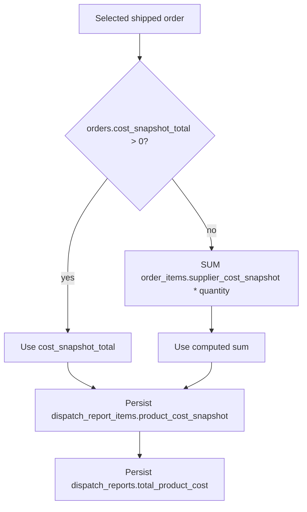

# v0.4.5.0 Daily Dispatch Report + Cost Snapshot Foundation

**Source of truth:** Old IBS-LK extension workflow spec (Iqbal & Brothers supplier operations).  
**Base version:** `75cc346` v0.4.4.0 Fulfillment Workflow Action Foundation.

---

## Owner corrections (locked before implementation)

### 1. Dispatch report reference format

- **Base:** `DDMMYYYY` (e.g. `06062026`)
- **Multiple reports same day:** `DDMMYYYY-P1`, `DDMMYYYY-P2`, `DDMMYYYY-P3`, …
- **Do NOT** use `DDMMYYYY(COUNT_ORDER)` or embed order count in the reference string
- **Order count** stored separately in `ibs_dispatch_reports.total_orders`

**Generator algorithm** ([`app/Domain/DispatchReportReference.php`](app/Domain/DispatchReportReference.php)):

1. If no report exists for today’s date prefix → `06062026`
2. If `06062026` already exists → next is `06062026-P1`
3. If `06062026-P1` exists → next is `06062026-P2`, and so on
4. Respect `UNIQUE KEY uq_dispatch_reference`; scan existing refs before insert

### 2. Supplier payable rule (planning + foundation only)

- **Dispatch Report is the official supplier payable checkpoint** — supplier payable starts from Dispatch Report, **not** Delivered
- **v0.4.5.0:** create dispatch cost snapshot foundation only — **no** `ibs_payable_ledgers` writes, no payable creation UI

### 3. Cost snapshot rule (immutable)

- Snapshot supplier cost **at dispatch report creation time** from `ibs_orders` / `ibs_order_items`
- Old dispatch reports must **never** recalculate using latest product cost on read or display
- **Never** use `selling_price`, `order_total`, or live `ibs_products` cost for supplier payable snapshot
- All reads of report totals/items use stored `product_cost_snapshot` / `total_product_cost` only

### 4. Product-line limitation (no new migration)

- Use existing 0006 tables only — **no** `product_id`, variant, or supplier model columns on `dispatch_report_items` today
- **v0.4.5.0 storage:** one `dispatch_report_items` row per **order** with order-level `product_cost_snapshot` + `item_count`
- **v0.4.5.0 display:** product name, variant, qty, supplier model shown by **reading** `ibs_order_items` at view time (informational only — not re-snapshotted to dispatch item rows)
- **DEV note** (UI + planning): *"Product/option-level immutable dispatch lines will be added in future migration."*

### 5. After dispatch report create — workflow

For each selected shipped order:

- `ibs_orders.ibs_status` → `dispatch_report_created`
- Mirror manual order by `order_reference` (existing helper)
- `ibs_order_workflow_histories`: `from=shipped`, `to=dispatch_report_created`, `action_note=Dispatch Report {reference}`

### 6. Duplicate prevention

- Same `order_id` **cannot** appear in more than one dispatch report (`dispatch_report_items` with `status=included`)
- Eligible list excludes already-included orders; create validates again before insert

### 7. Safety (non-negotiable)

- No payable creation
- No return deduction
- No stock deduction
- No invoice generation
- No live sync
- No new migration
- No auto schema repair
- No CREATE/ALTER on page load
- No commit

**Proceed with implementation only after this plan is approved.**

---

## Planning question answers

### 1. Which dispatch tables does migration 0006 provide?

From [`database/migrations/0006_dispatch_returns_payables.sql`](database/migrations/0006_dispatch_returns_payables.sql), **in scope for v0.4.5.0**:

**`ibs_dispatch_reports`**
- `dispatch_report_id`, `dispatch_reference` (UNIQUE), `supplier_id`, `business_source_id`, `dispatch_date`
- `total_orders`, `total_product_cost`, `status` (default `draft`)
- `locked_by`, `locked_at`, `created_by`, `created_at`, `updated_at`

**`ibs_dispatch_report_items`**
- `dispatch_report_item_id`, `dispatch_report_id`, `order_id`, `manual_order_id`, `order_reference`
- `product_cost_snapshot`, `item_count`, `status` (default `included`), `created_at`
- Index on `order_id` (not UNIQUE — duplicate prevention is **application-level**)

**Not used in v0.4.5.0:** return tables, `ibs_payable_ledgers`, settlement tables.

---

### 2. Can v0.4.5.0 ship without a new migration?

**Yes.** Existing 0006 columns cover order-level snapshot foundation:

| Requirement | Existing column |
|-------------|-----------------|
| Batch reference | `dispatch_reports.dispatch_reference` (`DDMMYYYY` or `DDMMYYYY-Pn`) |
| Order count | `dispatch_reports.total_orders` (separate from reference) |
| Order-level cost snapshot | `dispatch_report_items.product_cost_snapshot` |
| Quantity hint | `dispatch_report_items.item_count` |
| Report cost total | `dispatch_reports.total_product_cost` |
| Lock metadata | `status`, `locked_by`, `locked_at` |

Product/option immutable lines → future migration (DEV note only in v0.4.5.0).

---

### 3. What if dispatch tables are missing?

- [`WriteGate::dispatchReports()`](app/ReadFoundation/WriteGate.php) blocks writes
- Page shows gate warning + migration `0006_dispatch_returns_payables.sql` hint
- No crash, no CREATE TABLE

**v0.4.5.0:** add `ibs_order_workflow_histories` to dispatch WriteGate.

---

### 4. How will cost snapshot be calculated?

At **create time only** (frozen forever on report/item rows):

- **Forbidden:** `order_total`, `selling_price`, live product cost
- Display of product details: read `ibs_order_items` join — **do not** overwrite stored snapshots

---

### 5. How will duplicate order inclusion be blocked?

1. Eligible query: `ibs_status = shipped` AND `order_id` NOT IN (included dispatch items)
2. Pre-insert validation per `order_id[]`
3. Reference uniqueness via `uq_dispatch_reference` + `DDMMYYYY-Pn` generator
4. Abort entire batch if any order fails validation (all-or-nothing)

---

### 6. How will orders move to `dispatch_report_created`?

Via [`OrderWorkflowWriteService::recordDispatchInclusion()`](app/Services/Write/OrderWorkflowWriteService.php):

- System action from Dispatch Reports (skips UI checkbox/confirm)
- History note exactly: `Dispatch Report {reference}` (e.g. `Dispatch Report 06062026-P1`)
- Called from [`DispatchReportWriteService`](app/Services/Write/DispatchReportWriteService.php) — **replace** obsolete `createFromReadyOrders()` / `ready_for_dispatch`

---

### 7. v0.4.4 compatibility

| State | `/order-workflow` | `/dispatch-reports` |
|-------|-------------------|---------------------|
| 0006 **missing** | Keep manual Create Dispatch Report (v0.4.4 status-only) | Write gate blocked |
| 0006 **ready** | Hide Create Dispatch Report; link to Dispatch Reports | Primary owner/admin batch create |

---

## Implementation scope (urgent core, no UI polish)

### A. Rewrite dispatch write path

**[`app/Services/Write/DispatchReportWriteService.php`](app/Services/Write/DispatchReportWriteService.php)** — `createDailyBatch()`:

- Input: `order_ids[]`, confirmation flag; max 50; same supplier
- Reference: `DispatchReportReference::nextForToday()` → `DDMMYYYY` or `DDMMYYYY-Pn`
- Set `total_orders` = count(selected), **not** in reference string
- Immutable snapshots on insert; `status=draft`, set `locked_at`/`locked_by`/`created_by`
- Per order: item row + `recordDispatchInclusion()`
- ActivityLog `dispatch_report_created`
- **No** payable / return / stock / invoice / sync calls

**Repositories / domain:**
- [`app/Domain/DispatchReportReference.php`](app/Domain/DispatchReportReference.php) — **new**
- [`app/Repositories/Write/DispatchReportItemWriteRepository.php`](app/Repositories/Write/DispatchReportItemWriteRepository.php) — `existsForOrderId()`
- [`app/Repositories/DispatchReportRepository.php`](app/Repositories/DispatchReportRepository.php) — `latest()`, `findItemsWithOrders()`
- [`app/Repositories/OrderItemRepository.php`](app/Repositories/OrderItemRepository.php) — `findByOrderId()`, cost sum
- [`app/Repositories/Write/OrderWriteRepository.php`](app/Repositories/Write/OrderWriteRepository.php) — `findShippedEligible()`

### B. Dispatch Reports page

**[`resources/views/dispatch-reports/index.php`](resources/views/dispatch-reports/index.php):**

1. Eligible shipped orders (checkbox, max 50) — ref, customer, qty, **snapshot cost preview**
2. Create batch — confirm + single POST
3. Latest reports — reference, `total_orders`, `total_product_cost`, status, created_at
4. Report detail — orders + **product lines from `order_items` read** (display only) + stored snapshot cost
5. DEV note: product/option immutable lines future migration
6. Payable checkpoint note: dispatch = payable start (foundation only; no ledger)
7. Safety badges; `.table-scroll` wrappers

**[`app/Controllers/DispatchReportsController.php`](app/Controllers/DispatchReportsController.php):** update `batchReferenceRule()` and `costSnapshotRule()` copy to match corrections above.

### C. Workflow integration

- [`OrderWorkflowController`](app/Controllers/OrderWorkflowController.php) — hide Shipped Create Dispatch Report when `WriteGate::dispatchReports()['ready']`
- [`OrderWorkflowStatus::DISPATCH_DEV_NOTE`](app/Domain/OrderWorkflowStatus.php) — point to v0.4.5.0 module

### D. Version / QA

- [`config/app.php`](config/app.php) → `0.4.5.0` / `Daily Dispatch Report + Cost Snapshot Foundation`
- [`WriteGate`](app/ReadFoundation/WriteGate.php), [`SprintMergeQa`](app/ReadFoundation/SprintMergeQa.php), [`VersionController`](app/Controllers/VersionController.php)

### E. Explicitly unchanged

- [`ManualOrderWriteService`](app/Services/Write/ManualOrderWriteService.php) create logic
- Product Control
- v0.4.4 workflow rules (except Shipped action visibility + dispatch hook)

---

## Files expected to change

| File | Change |
|------|--------|
| `app/Domain/DispatchReportReference.php` | **New** — DDMMYYYY / DDMMYYYY-Pn generator |
| `app/Services/Write/DispatchReportWriteService.php` | Batch create rewrite |
| `app/Services/Write/OrderWorkflowWriteService.php` | `recordDispatchInclusion()` |
| `app/Repositories/Write/DispatchReportItemWriteRepository.php` | Duplicate check |
| `app/Repositories/Write/DispatchReportWriteRepository.php` | Lock/created_by fields |
| `app/Repositories/Write/OrderWriteRepository.php` | Eligible shipped query |
| `app/Repositories/DispatchReportRepository.php` | Latest + detail joins |
| `app/Repositories/OrderItemRepository.php` | Per-order items + cost sum |
| `app/Controllers/DispatchReportsController.php` | Data + planning copy |
| `resources/views/dispatch-reports/index.php` | Functional UI |
| `app/Controllers/OrderWorkflowController.php` | Shipped action gating |
| `app/Domain/OrderWorkflowStatus.php` | Dev note update |
| `app/ReadFoundation/WriteGate.php` | + workflow histories |
| `app/ReadFoundation/SprintMergeQa.php` | QA row |
| `config/app.php`, `app/Controllers/VersionController.php` | Version bump |

---

## Browser tests (after build)

**Prerequisites:** 0005 + 0006 applied; 2+ orders at **Shipped**.

| # | Test | Expected |
|---|------|----------|
| 1 | `/dispatch-reports` without 0006 | Gate warning; no crash |
| 2 | With 0006 ready | Eligible shipped only; max 50 |
| 3 | Create 0 selected | Error; no rows |
| 4 | First batch today (1 order) | Ref `DDMMYYYY`; `total_orders=1`; snapshot stored; order → `dispatch_report_created`; history `Dispatch Report DDMMYYYY` |
| 5 | First batch today (N orders) | Ref `DDMMYYYY`; `total_orders=N`; `total_product_cost` = sum snapshots |
| 6 | Second batch same day | Ref `DDMMYYYY-P1` (then P2, P3) |
| 7 | Re-include same order | Blocked |
| 8 | `cost_snapshot_total=0`, line costs present | Fallback sum from `order_items` |
| 9 | Mixed suppliers | Rejected |
| 10 | Report detail | Stored snapshot cost shown; product lines from `order_items` read; DEV note visible |
| 11 | Re-open old report after product cost edit | Report totals unchanged (immutable) |
| 12 | `/order-workflow` with 0006 ready | No Create Dispatch Report on Shipped |
| 13 | No payable/stock/invoice/sync side effects | Confirmed |
| 14 | `tools/check-local.ps1` | ALL GREEN |

---

## Execution order

1. `DispatchReportReference` + repositories + cost helpers
2. `DispatchReportWriteService.createDailyBatch()` + immutable snapshot rules
3. `OrderWorkflowWriteService.recordDispatchInclusion()`
4. Controller + view (eligible, create, list, detail + DEV notes)
5. Order Workflow Shipped gating
6. WriteGate / version / SprintMergeQa
7. `check-local.ps1` — **no commit**
